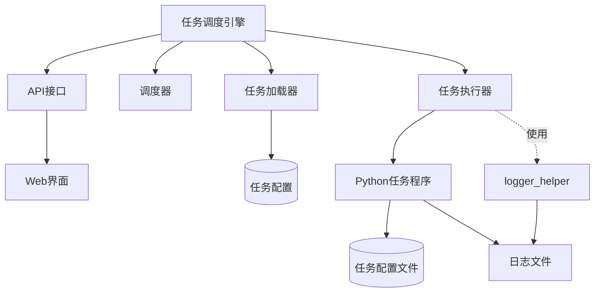

# 设计文档：通用任务调度引擎

## 概述

通用任务调度引擎是一个独立的系统组件，用于定义、配置和调度各种自动化任务。该引擎使用 cron 语法设置任务调度规则，并提供统一的配置、执行和监控机制。系统设计确保不会干扰现有的 auto_login.py 任务的正常执行。

## 架构

### 整体架构



### 核心组件

1. **任务调度引擎（SchedulerEngine）**：
   - 系统的核心组件，负责协调各个子组件的工作
   - 管理任务的生命周期
   - 提供API接口供外部系统调用

2. **任务加载器（TaskLoader）**：
   - 负责从配置文件加载任务定义
   - 验证任务配置的有效性
   - 将任务转换为内部表示形式

3. **调度器（Scheduler）**：
   - 基于APScheduler实现
   - 根据cron表达式调度任务
   - 管理任务的执行时间

4. **任务执行器（TaskExecutor）**：
   - 负责启动Python程序
   - 传递配置参数
   - 监控任务执行状态
   - 处理任务超时和重试
   - 使用现有的logger_helper模块记录执行结果和日志

5. **API接口（APIInterface）**：
   - 提供RESTful API
   - 支持任务的CRUD操作
   - 支持任务状态查询
   - 支持手动触发任务
   - 提供日志查询接口

6. **Web界面（WebInterface）**：
   - 基于Flask实现
   - 提供任务管理界面
   - 提供任务配置界面
   - 提供任务监控界面
   - 提供日志查看界面

## 数据模型

### 任务模型（Task）

```python
class Task:
    """任务模型类"""
    def __init__(self, task_id, task_name, task_exec, task_schedule, **kwargs):
        self.task_id = task_id                # 任务ID
        self.task_name = task_name            # 任务名称
        self.task_desc = kwargs.get('task_desc', '')  # 任务描述
        self.task_exec = task_exec            # 执行程序路径
        self.task_schedule = task_schedule    # 调度规则
        self.task_timeout = kwargs.get('task_timeout', None)  # 超时时间
        self.task_retry = kwargs.get('task_retry', 0)  # 重试次数
        self.task_retry_interval = kwargs.get('task_retry_interval', 60)  # 重试间隔
        self.task_enabled = kwargs.get('task_enabled', True)  # 是否启用
        self.task_log = kwargs.get('task_log', f'logs/task_{task_id}.log')  # 日志文件
        self.task_env = kwargs.get('task_env', {})  # 环境变量（包含任务参数）
        self.task_dependencies = kwargs.get('task_dependencies', [])  # 依赖任务
        self.task_notify = kwargs.get('task_notify', {})  # 通知设置
```

### 任务执行记录模型（TaskExecution）

```python
class TaskExecution:
    """任务执行记录模型类"""
    def __init__(self, task_id, execution_id, start_time):
        self.task_id = task_id                # 任务ID
        self.execution_id = execution_id      # 执行ID
        self.start_time = start_time          # 开始时间
        self.end_time = None                  # 结束时间
        self.status = 'running'               # 状态：running, success, failed
        self.return_code = None               # 返回码
        self.error_message = None             # 错误信息
        self.duration = None                  # 执行时长
```

### 任务配置模型（TaskConfig）

```python
class TaskConfig:
    """任务配置模型类"""
    def __init__(self, config_dict=None):
        self.config = config_dict or {}       # 配置字典
        
    def get(self, key, default=None):
        """获取配置项"""
        return self.config.get(key, default)
        
    def set(self, key, value):
        """设置配置项"""
        self.config[key] = value
        
    def to_dict(self):
        """转换为字典"""
        return self.config
```

## 接口设计

### API接口

#### 1. 任务管理接口

- **GET /api/tasks**：获取所有任务列表
- **GET /api/tasks/{task_id}**：获取指定任务详情
- **POST /api/tasks**：创建新任务
- **PUT /api/tasks/{task_id}**：更新任务配置
- **DELETE /api/tasks/{task_id}**：删除任务

#### 2. 任务执行接口

- **POST /api/tasks/{task_id}/execute**：手动触发任务执行
- **GET /api/tasks/{task_id}/executions**：获取任务执行历史
- **GET /api/tasks/{task_id}/executions/{execution_id}**：获取指定执行详情
- **POST /api/tasks/{task_id}/stop**：停止正在执行的任务

#### 3. 任务状态接口

- **GET /api/tasks/{task_id}/status**：获取任务状态
- **GET /api/tasks/{task_id}/next-run**：获取下次执行时间

#### 4. 日志接口

- **GET /api/tasks/{task_id}/logs**：获取任务日志
- **GET /api/tasks/{task_id}/logs/download**：下载任务日志文件

### Web界面路由

- **GET /**：首页，显示任务列表
- **GET /tasks/new**：创建新任务页面
- **GET /tasks/{task_id}/edit**：编辑任务页面
- **GET /tasks/{task_id}/view**：查看任务详情页面
- **GET /tasks/{task_id}/logs**：查看任务日志页面
- **GET /tasks/{task_id}/executions**：查看任务执行历史页面

## 数据存储设计

### 持久化存储

1. **存储方式**：
   - 初期采用 JSON 文件进行任务信息的持久化存储
   - 设计时考虑未来迁移到数据库的可能性，保持数据结构的一致性
   - 文件操作采用原子写入方式，避免并发访问导致的数据损坏

2. **存储位置**：
   - 任务定义存储在 `conf/tasks.json` 文件中
   - 任务执行历史记录存储在 `conf/task_history.json` 文件中
   - 任务状态信息存储在 `conf/task_status.json` 文件中

3. **备份机制**：
   - 每次修改前自动备份当前配置文件
   - 定期（如每日）创建配置文件备份
   - 提供配置恢复功能

4. **迁移路径**：
   - 设计数据访问层（DAL）接口，隔离存储实现细节
   - 初期实现基于文件的 DAL
   - 未来可以实现基于数据库的 DAL，无需修改业务逻辑

### 数据访问层设计

```python
class TaskDataAccess:
    """任务数据访问接口"""
    
    def get_all_tasks(self):
        """获取所有任务"""
        pass
        
    def get_task_by_id(self, task_id):
        """获取指定任务"""
        pass
        
    def save_task(self, task):
        """保存任务"""
        pass
        
    def delete_task(self, task_id):
        """删除任务"""
        pass
        
    def get_task_history(self, task_id, limit=10):
        """获取任务执行历史"""
        pass
        
    def save_task_execution(self, execution):
        """保存任务执行记录"""
        pass
        
    def get_task_status(self, task_id):
        """获取任务状态"""
        pass
        
    def update_task_status(self, task_id, status):
        """更新任务状态"""
        pass


class FileTaskDataAccess(TaskDataAccess):
    """基于文件的任务数据访问实现"""
    
    def __init__(self, tasks_file, history_file, status_file):
        self.tasks_file = tasks_file
        self.history_file = history_file
        self.status_file = status_file
        
    def get_all_tasks(self):
        """从文件中读取所有任务"""
        if not os.path.exists(self.tasks_file):
            return []
        with open(self.tasks_file, 'r') as f:
            data = json.load(f)
            return [Task(**task) for task in data.get('tasks', [])]
    
    # 其他方法实现...
```

## 配置文件格式

### 任务配置文件（JSON格式）

```json
{
  "tasks": [
    {
      "task_id": "test-task",
      "task_name": "测试任务",
      "task_desc": "用于测试任务调度引擎的功能",
      "task_exec": "tasks/test_task.py",
      "task_schedule": "*/3 * * * *",
      "task_timeout": 300,
      "task_retry": 3,
      "task_retry_interval": 60,
      "task_enabled": true,
      "task_log": "logs/task_test-task.log",
      "task_env": {
        "TASK_NAME": "测试任务",
        "TASK_DESCRIPTION": "用于测试任务调度引擎的功能",
        "PARAM1": "值1",
        "PARAM2": "值2",
        "PARAM3": "值3",
        "DISPLAY_COLOR": "blue",
        "DISPLAY_STYLE": "bold",
        "DISPLAY_BORDER": "double"
      },
      "task_dependencies": [],
      "task_notify": {
        "on_success": false,
        "on_failure": true,
        "email": "admin@example.com"
      }
    }
  ]
}
```


## 错误处理

### 错误类型

1. **配置错误**：任务配置格式错误或缺少必要字段
2. **调度错误**：cron表达式格式错误或调度失败
3. **执行错误**：任务执行失败、超时或返回非零状态码
4. **依赖错误**：依赖任务未完成或失败
5. **系统错误**：系统资源不足或其他系统级错误

### 错误处理策略

1. **日志记录**：所有错误都记录到日志文件
2. **重试机制**：根据配置的重试次数和间隔进行重试
3. **通知机制**：根据配置发送错误通知
4. **状态更新**：更新任务状态和执行记录
5. **优雅降级**：在部分功能不可用时保持系统其他部分正常运行

## 日志记录

### 调度器日志

1. **日志目标**：
   - 任务调度引擎本身的日志记录到 `logs/sys.log` 文件
   - 同时输出到控制台（console）
   - 保持与现有项目风格一致

2. **日志级别**：
   - ERROR：严重错误，影响系统正常运行
   - WARNING：警告信息，可能影响系统部分功能
   - INFO：一般信息，记录系统正常运行状态
   - DEBUG：调试信息，仅在调试模式下启用

3. **日志格式**：
   - 时间戳
   - 日志级别
   - 模块名称
   - 日志消息
   - 例如：`2023-07-17 10:30:45 - INFO - SchedulerEngine - 任务调度引擎启动成功`

4. **关键日志事件**：
   - 系统启动和关闭
   - 任务加载和验证
   - 任务调度和执行
   - 错误和异常情况
   - 配置变更

### 任务日志

1. **日志目标**：
   - 每个任务的执行日志记录到独立的日志文件 `logs/task_{task_id}.log`
   - 可选择是否同时输出到控制台

2. **日志内容**：
   - 任务开始和结束时间
   - 任务执行状态和结果
   - 任务执行过程中的关键步骤
   - 错误和异常信息

## 测试任务设计

### test_task.py

```python
#!/usr/bin/env python
# -*- coding: utf-8 -*-

"""
测试任务模块
用于验证通用任务调度引擎的功能
"""

import os
import sys
import time
import json
import logging
from datetime import datetime

# 配置日志
def setup_logger(log_file):
    """设置日志记录器"""
    logger = logging.getLogger('test_task')
    logger.setLevel(logging.INFO)
    
    # 文件处理器
    file_handler = logging.FileHandler(log_file)
    file_handler.setLevel(logging.INFO)
    
    # 控制台处理器
    console_handler = logging.StreamHandler()
    console_handler.setLevel(logging.INFO)
    
    # 格式化器
    formatter = logging.Formatter('%(asctime)s - %(name)s - %(levelname)s - %(message)s')
    file_handler.setFormatter(formatter)
    console_handler.setFormatter(formatter)
    
    # 添加处理器
    logger.addHandler(file_handler)
    logger.addHandler(console_handler)
    
    return logger

def print_fancy_config(env_vars, logger):
    """以美观的格式打印环境变量配置"""
    logger.info("=" * 50)
    logger.info("测试任务配置")
    logger.info("=" * 50)
    
    # 按类别分组显示配置
    categories = {
        "任务信息": ["TASK_"],
        "参数设置": ["PARAM"],
        "显示设置": ["DISPLAY_"]
    }
    
    for category, prefixes in categories.items():
        logger.info(f"【{category}】")
        has_items = False
        
        for key, value in env_vars.items():
            if any(key.startswith(prefix) for prefix in prefixes):
                logger.info(f"  {key} = {value}")
                has_items = True
        
        if has_items:
            logger.info("-" * 50)
    
    # 显示未分类的配置项
    other_items = {k: v for k, v in env_vars.items() 
                  if not any(k.startswith(p) for c in categories.values() for p in c)}
    
    if other_items:
        logger.info("【其他设置】")
        for key, value in other_items.items():
            logger.info(f"  {key} = {value}")
        logger.info("-" * 50)
    
    logger.info("配置加载完成")
    logger.info("=" * 50)

def main():
    """主函数"""
    # 获取日志文件路径
    log_file = os.environ.get('TASK_LOG', 'logs/task_test-task.log')
    os.makedirs(os.path.dirname(log_file), exist_ok=True)
    
    # 设置日志记录器
    logger = setup_logger(log_file)
    
    # 记录开始时间
    start_time = datetime.now()
    logger.info(f"任务开始执行: {start_time}")
    
    # 收集环境变量配置
    env_config = {k: v for k, v in os.environ.items() if k.startswith(('TASK_', 'PARAM', 'DISPLAY_'))}
    
    # 打印配置
    print_fancy_config(env_config, logger)
    
    # 记录传入的参数
    logger.info("传入的命令行参数:")
    for i, arg in enumerate(sys.argv):
        logger.info(f"  参数 {i}: {arg}")
    
    # 记录所有环境变量
    logger.info("所有环境变量:")
    for key, value in sorted(os.environ.items()):
        if key.startswith(('TASK_', 'PARAM', 'DISPLAY_')):
            logger.info(f"  {key} = {value}")
    
    # 模拟任务执行
    logger.info("正在执行任务...")
    time.sleep(2)  # 模拟任务执行时间
    
    # 记录结束时间
    end_time = datetime.now()
    duration = (end_time - start_time).total_seconds()
    logger.info(f"任务执行完成: {end_time}")
    logger.info(f"执行时长: {duration:.2f} 秒")
    
    return 0

if __name__ == "__main__":
    sys.exit(main())
```

## Web界面设计

### 任务列表页面

- 显示所有已配置任务的列表
- 每个任务显示ID、名称、状态、下次执行时间、最近执行结果
- 提供创建、编辑、删除、执行按钮
- 提供任务启用/禁用开关
- 提供任务搜索和筛选功能

### 任务创建/编辑页面

- 提供表单输入任务基本信息
- 提供cron表达式输入框和常用模板选择
- 提供cron表达式验证和下次执行时间预览
- 提供键值对编辑器用于配置任务参数
- 提供高级选项（超时、重试、通知等）

### 任务详情页面

- 显示任务的详细配置信息
- 显示任务的执行状态和历史
- 显示任务的依赖关系
- 提供手动触发执行按钮

### 日志查看页面

- 提供实时日志查看功能
- 支持按时间和级别筛选日志
- 支持日志搜索功能
- 提供日志下载功能

### 任务执行历史页面

- 显示任务的执行历史记录
- 每条记录包括执行时间、状态、耗时、结果
- 提供详细信息查看功能
- 支持按时间和状态筛选

## 安全考虑

1. **认证和授权**：
   - 实现用户认证机制
   - 基于角色的访问控制
   - API密钥认证

2. **输入验证**：
   - 验证所有用户输入
   - 防止命令注入
   - 防止跨站脚本攻击

3. **安全执行**：
   - 限制任务执行权限
   - 资源使用限制
   - 超时控制

4. **数据保护**：
   - 敏感配置加密存储
   - 日志脱敏
   - 安全的配置文件权限

## 扩展性考虑

1. **插件系统**：
   - 支持自定义任务类型
   - 支持自定义通知方式
   - 支持自定义日志处理

2. **分布式支持**：
   - 支持多节点部署
   - 任务分发和负载均衡
   - 集中式日志和监控

3. **集成能力**：
   - 提供webhook接口
   - 支持与其他系统集成
   - 支持导入/导出任务配置

## 测试策略

1. **单元测试**：
   - 测试各个组件的功能
   - 测试错误处理和边界条件
   - 测试配置解析和验证

2. **集成测试**：
   - 测试组件之间的交互
   - 测试API接口
   - 测试Web界面功能

3. **系统测试**：
   - 测试完整的任务生命周期
   - 测试并发任务执行
   - 测试长时间运行的稳定性

4. **性能测试**：
   - 测试系统在高负载下的表现
   - 测试资源使用情况
   - 测试响应时间和吞吐量