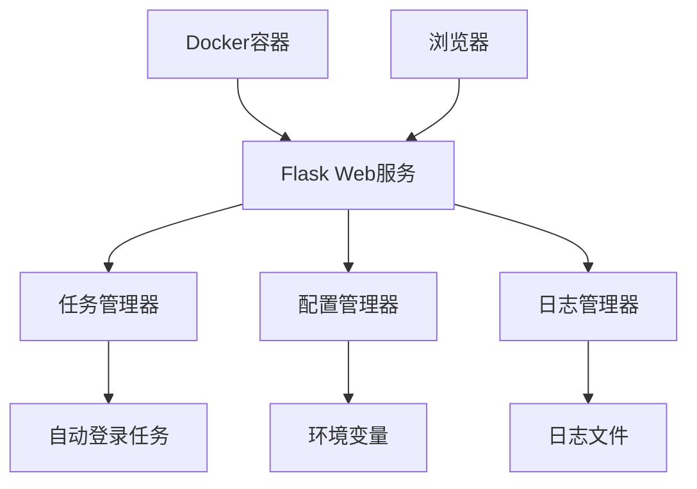

# 设计文档

## 概述

本设计文档描述了自动登录系统Web任务管理器的实现方案。该功能将改变Docker容器的默认启动行为，使其启动Web界面而非后台任务，并提供通过Web界面管理自动登录任务的能力。用户可以查看任务列表、启动/停止任务、查看任务状态和日志。

## 架构

系统将采用前后端分离的架构，使用Flask作为后端框架，提供RESTful API接口，前端使用HTML、CSS和JavaScript实现交互界面。

### 系统组件图



## 组件和接口

### 1. Web服务器组件

**职责**：
- 提供Web界面
- 处理HTTP请求
- 提供RESTful API接口

**接口**：
- `GET /` - 返回主页面
- `GET /api/tasks` - 获取任务列表
- `POST /api/tasks/{task_id}/start` - 启动指定任务
- `POST /api/tasks/{task_id}/stop` - 停止指定任务
- `GET /api/tasks/{task_id}/status` - 获取任务状态
- `GET /api/tasks/{task_id}/logs` - 获取任务日志
- `GET /api/config` - 获取系统配置
- `POST /api/config` - 更新系统配置

### 2. 任务管理器组件

**职责**：
- 管理自动登录任务
- 启动和停止任务
- 监控任务状态
- 维护任务元数据

**接口**：
- `get_tasks()` - 获取所有任务
- `get_task(task_id)` - 获取指定任务
- `start_task(task_id)` - 启动任务
- `stop_task(task_id)` - 停止任务
- `get_task_status(task_id)` - 获取任务状态
- `get_task_logs(task_id)` - 获取任务日志

### 3. 配置管理器组件

**职责**：
- 读取系统配置
- 更新系统配置
- 验证配置有效性

**接口**：
- `get_config()` - 获取当前配置
- `update_config(config)` - 更新配置
- `validate_config(config)` - 验证配置有效性

### 4. 日志管理器组件

**职责**：
- 读取日志文件
- 过滤日志内容
- 格式化日志输出

**接口**：
- `get_logs(task_id, limit, offset)` - 获取指定任务的日志
- `get_system_logs(limit, offset)` - 获取系统日志

## 数据模型

### 任务模型

```python
class Task:
    id: str                  # 任务ID
    name: str                # 任务名称
    description: str         # 任务描述
    status: str              # 任务状态（running, stopped, error）
    schedule: str            # 任务调度表达式
    last_run: datetime       # 上次运行时间
    next_run: datetime       # 下次计划运行时间
    config: dict             # 任务配置
    process: Process         # 任务进程（运行时）
```

### 配置模型

```python
class Config:
    website_url: str         # 网站URL
    username: str            # 用户名
    password: str            # 密码
    max_retries: int         # 最大重试次数
    login_schedule_type: str # 调度类型
    login_schedule_date: str # 调度日期
    login_schedule_time: str # 调度时间
    log_level: str           # 日志级别
```

### 日志模型

```python
class LogEntry:
    timestamp: datetime      # 时间戳
    level: str               # 日志级别
    message: str             # 日志消息
    task_id: str             # 相关任务ID
```

## 错误处理

1. **任务操作错误**：
   - 当任务启动或停止失败时，返回适当的HTTP错误码和错误消息
   - 记录详细错误日志以便排查

2. **配置错误**：
   - 验证所有配置参数，确保其有效性
   - 当配置无效时，返回详细的错误信息
   - 保持原有配置不变，避免系统进入不稳定状态

3. **系统错误**：
   - 捕获所有未处理的异常
   - 记录详细错误日志
   - 返回友好的错误消息给用户

## 测试策略

1. **单元测试**：
   - 测试各个组件的核心功能
   - 模拟外部依赖以确保测试的隔离性

2. **集成测试**：
   - 测试组件之间的交互
   - 验证API接口的正确性

3. **端到端测试**：
   - 模拟用户操作，验证完整流程
   - 测试Docker容器启动行为

4. **安全测试**：
   - 验证API接口的安全性
   - 测试敏感信息的保护措施

## 实现计划

1. 修改Docker容器启动脚本，默认启动Web界面
2. 实现任务管理器组件
3. 实现Web界面和API接口
4. 实现配置管理功能
5. 实现日志查看功能
6. 集成测试和部署

## 技术选择

1. **后端**：
   - Flask：轻量级Web框架
   - APScheduler：任务调度库
   - Python标准库：进程管理、文件操作

2. **前端**：
   - HTML5/CSS3：页面结构和样式
   - JavaScript/jQuery：交互逻辑
   - Bootstrap：响应式UI组件

3. **数据存储**：
   - 文件系统：配置文件和日志存储
   - 内存：运行时任务状态管理

4. **容器化**：
   - Docker：应用容器化
   - 环境变量：配置注入